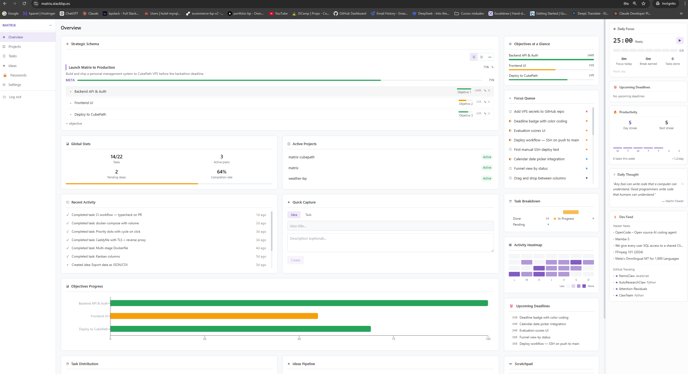
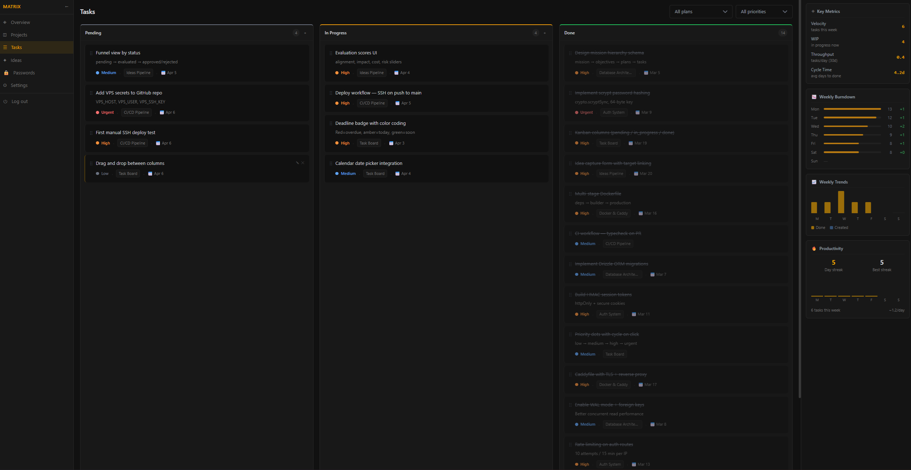
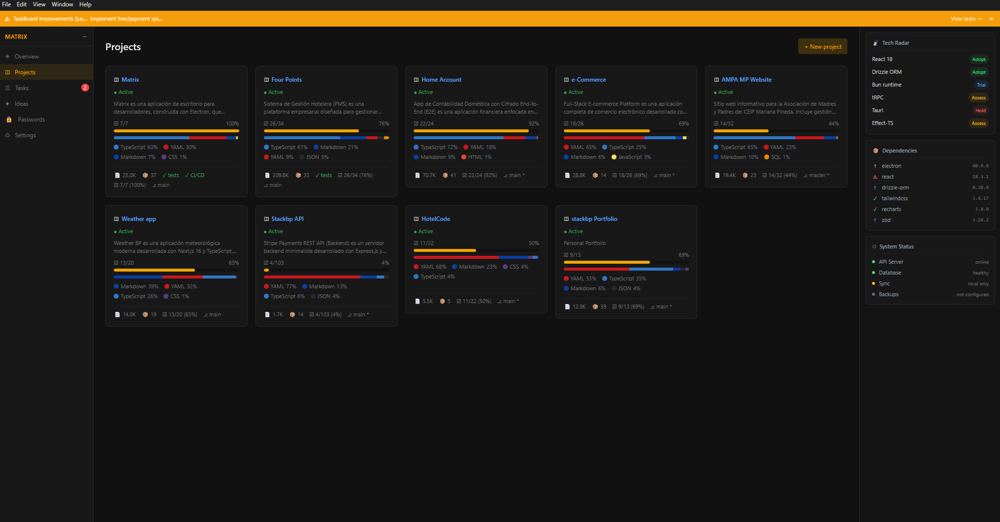

# Matrix — Sistema de Gestión de Proyectos

<p align="center">
  Matrix es una plataforma full-stack de productividad pensada para desarrolladores que manejan múltiples proyectos a la vez. Conecta tu misión de alto nivel con las tareas del día a día a través de una jerarquía clara (<strong>Mission → Objectives → Plans → Tasks</strong>), sincroniza tus repos de GitHub, evalúa ideas antes de comprometerte con ellas, almacena contraseñas de forma segura y te ofrece métricas, rachas de tareas ejecutadas y una vista de enfoque diario para que nada se pierda.
</p>

<p align="center">
  <strong>Define tu misión. Divídela en objetivos. Planifica. Ejecuta las tareas para cada plan. Controla cada proyecto, captura cada idea y guarda tus credenciales de forma segura — todo desde un dashboard self-hosted.</strong>
</p>

<p align="center">
  <a href="#demo">Demo</a> •
  <a href="#el-problema">El Problema</a> •
  <a href="#características">Características</a> •
  <a href="#despliegue-en-cubepath">Despliegue</a> •
  <a href="#tech-stack">Stack</a>
</p>

---

<p align="center">
  
</p>

<p align="center">
  
</p>

<p align="center">
  
</p>

---

## Demo

Hay una demo en vivo disponible en **[matrix.stackbp.es](https://matrix.stackbp.es)**

Haz clic en el botón `$ access --demo` en la página de login — rellena automáticamente las credenciales de demo con un cursor animado y te loguea. También puedes introducir `demo / demo1234` manualmente.

La cuenta demo viene con datos precargados (misiones, tareas, ideas, contraseñas). Usa el botón **Restaurar** en Settings para resetear los datos de demo en cualquier momento. Las acciones destructivas (eliminar misión, resetear base de datos) están ocultas para el usuario demo.

---

## El Problema

Tienes ideas dispersas en archivos `.txt`. Proyectos sin prioridades claras. Tareas desconectadas de cualquier objetivo mayor. Credenciales enterradas en algun .env o .txt perdido en tu PC.

Preguntas que aparecen constantemente:

- ¿Cuál es el plan real ahora mismo?
- ¿En qué tarea debería focalizarme hoy?
- ¿En qué estado están todos mis side projects?
- ¿Dónde guardé esa API key?

**Matrix** reúne todo esto en una plataforma self-hosted — tus datos, tu servidor, tus reglas.

---

## Características

### Mission Control

Planificación estructurada top-down: **Mission → Objectives → Plans → Tasks**. El progreso se acumula automáticamente en cada nivel para que siempre sepas dónde estás.

### Task Board

Tablero estilo Kanban con prioridades (crítica / alta / media / baja), deadlines y seguimiento de estado (Todo → In Progress → Done). Selector de fechas con calendario.

### Project Tracker

Sincroniza tus repos de GitHub. Cada proyecto muestra:

- Desglose de lenguajes (TypeScript, Python, Rust, Go...)
- Último commit, rama activa
- Cantidad de dependencias
- Detección de tests y CI/CD
- Estado de README / ROADMAP / TODO

Los proyectos se pueden vincular a cualquier estado de la jerarquía de misiones (polymorphic links).

### Ideas Pipeline

Captura ideas en bruto, puntúalas en varias dimensiones (alineamiento, impacto, coste, riesgo) y muévelas a través del flujo: `draft → evaluating → approved → in_progress → done / discarded`.

### Password Vault

Almacenamiento cifrado de contraseñas con categorías, notas y búsqueda.

### Daily Notes

Bloc de notas diario basado en calendario. Elige un día, escribe texto plano, se guarda en la base de datos. Los días con notas se marcan con un punto. Auto-guardado con debounce + botón de guardado manual.

### Activity & Analytics

Cada acción se registra automáticamente. El panel lateral muestra:

- Heatmap de actividad diaria/semanal
- Tendencias de tareas completadas
- Distribución del pipeline de ideas
- Temporizador Pomodoro + seguimiento de sesiones
- Contador de rachas

### Seguridad y Multi-usuario

Cada usuario tiene su propia base de datos SQLite aislada — los datos de un usuario nunca se mezclan con los de otro. Headers HTTP de seguridad en todas las respuestas. Detalles de errores internos ocultos en producción. Apagado graceful del servidor con timeout de respaldo. El registro de nuevos usuarios se controla por variable de entorno.

### i18n

Inglés y español soportados. Detecta automáticamente el idioma del navegador. La preferencia se almacena por usuario.

### Responsive

Totalmente funcional en móvil y tablet sin perder la experiencia de escritorio. El sidebar se colapsa en un overlay deslizable con botón hamburguesa. Las columnas Kanban se apilan verticalmente en pantallas pequeñas. Cada tarjeta de tarea incluye un selector de estado inline (solo en móvil) como alternativa al drag and drop. Todos los modales y vistas se adaptan con breakpoints de Tailwind — sin dependencias extra.

---

## Despliegue en CubePath

Matrix corre en producción sobre un VPS de [CubePath](https://cubepath.dev) con [Dokploy](https://dokploy.com) instalado como gestor de despliegues. El flujo es directo: el repositorio de GitHub está conectado a Dokploy, que escucha los pushes a `main`. Cada push dispara un build Docker multi-stage y redespliegue automático. Traefik (incluido en Dokploy) se encarga del HTTPS con certificados Let's Encrypt. La app completa — backend, frontend y base de datos — corre en un único contenedor dentro del VPS, accesible en [matrix.stackbp.es](https://matrix.stackbp.es).

**¿Por qué CubePath + Dokploy?**

- **Todo en un mismo lugar**: backend (Node.js + Express), base de datos (SQLite persistente en volumen Docker) y frontend (React servido como estático) corren en un único contenedor dentro del VPS, sin necesidad de servicios externos.
- **HTTPS automático**: Traefik (integrado en Dokploy) provisiona y renueva certificados Let's Encrypt sin configuración manual.
- **Deploy continuo**: cada push a `main` en GitHub dispara un rebuild y redespliegue automático — sin claves SSH, sin scripts de deploy, sin intervención manual.
- **Panel web**: Dokploy ofrece una interfaz visual para gestionar variables de entorno, dominios, logs y rollbacks — todo desde el navegador.
- **Simplicidad**: desde un `docker-compose.yml` y unas variables de entorno, la app completa queda en producción con HTTPS en minutos.

### Arquitectura

```
┌─── VPS (CubePath) ───────────────────────────────┐
│                                                   │
│  ┌── Traefik (Dokploy) ────────────────────────┐  │
│  │  Auto HTTPS (Let's Encrypt)                 │  │
│  │  Puertos 80/443 → reverse proxy a app:3939  │  │
│  └──────────────┬──────────────────────────────┘  │
│                 │                                  │
│  ┌── Contenedor: app ──────────────────────────┐  │
│  │  Node.js (Express + frontend estático)      │  │
│  │  Puerto 3939 (interno)                      │  │
│  └────────────────┬───────────────────────────┘   │
│                   │ lectura/escritura              │
│  ┌── Volumen: matrix_data (/data) ──────────────┐ │
│  │  auth.db        ← usuarios y sesiones        │ │
│  │  users/*.db     ← una DB aislada por usuario │ │
│  └──────────────────────────────────────────────┘ │
└───────────────────────────────────────────────────┘
```

---

## Tech Stack

| Capa       | Tecnología                                                       |
| ---------- | ---------------------------------------------------------------- |
| Backend    | Node.js + Express 4 + Drizzle ORM                                |
| Database   | SQLite vía better-sqlite3 (WAL mode) — una DB por usuario        |
| Frontend   | React 18 + Vite + Tailwind CSS 3.4                               |
| State      | Zustand + React Query                                            |
| Auth       | scrypt password hashing + HMAC session tokens + httpOnly cookies |
| Validation | Zod (backend) + validación client-side                           |
| Infra      | Docker multi-stage + Dokploy + Traefik (auto HTTPS)              |
| CI/CD      | GitHub Actions (typecheck) + Dokploy auto-deploy                 |
| Testing    | Vitest                                                           |

---

## Origen del proyecto

Matrix-CubePath es la evolución web de [Matrix](https://github.com/bpstack/matrix), originalmente construido como app de escritorio con Electron (pensada para uso personal). La jerarquía de misiones y la gestión de tareas se mantienen, pero la migración trajo cambios fundamentales:

|                          | Matrix (Electron)                                             | Matrix-CubePath (Web)                                       |
| ------------------------ | ------------------------------------------------------------- | ----------------------------------------------------------- |
| **Runtime**              | App de escritorio (.exe / .dmg)                               | Web app — accesible desde cualquier navegador               |
| **Usuarios**             | Un solo usuario, sin autenticación                            | Multi-usuario con registro, login y rate limiting           |
| **Base de datos**        | Un único archivo SQLite compartido                            | Auth DB + bases de datos SQLite aisladas por usuario        |
| **Escaneo de proyectos** | Sistema de archivos local (directorios, git info, file stats) | GitHub API (repos, lenguajes, commits, detección de README) |
| **Despliegue**           | Binario empaquetado con auto-updates                          | Contenedor Docker en cualquier VPS o cloud provider         |

---

## Licencia

MIT — desarrollado por [bpstack](https://github.com/bpstack)
