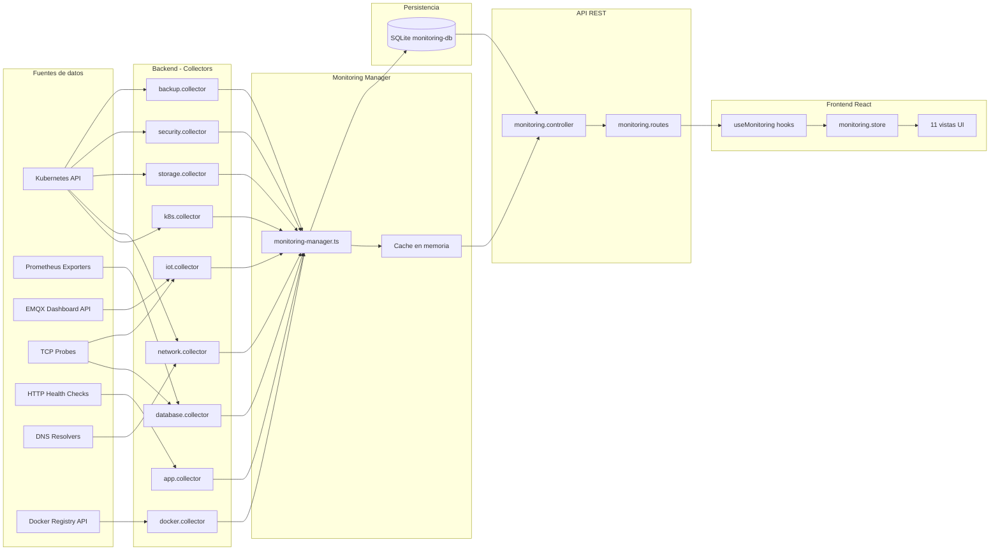
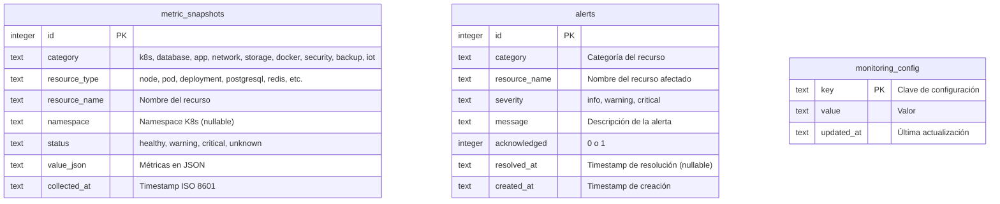
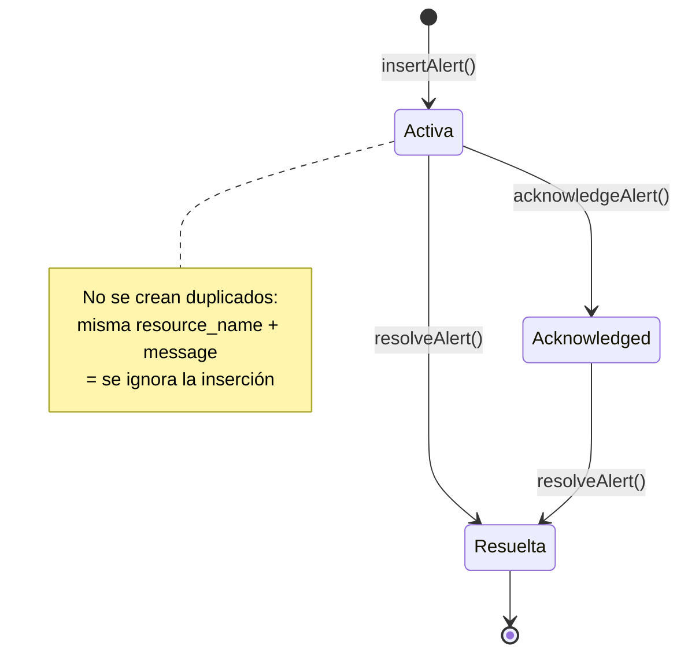

# Arquitectura del Sistema

## Flujo de datos

## Monitoring Manager

El `monitoring-manager.ts` es el orquestador central que gestiona todos los collectors.

### Intervalos de recolección

Los collectors se inician de forma escalonada (5 segundos entre cada uno) para evitar picos de carga:

| Collector | Intervalo | Inicio (offset) |
|-----------|-----------|-----------------|
| k8s | 60s (1 min) | +5s |
| database | 120s (2 min) | +10s |
| app | 120s (2 min) | +15s |
| iot | 120s (2 min) | +20s |
| network | 300s (5 min) | +25s |
| storage | 300s (5 min) | +30s |
| docker | 300s (5 min) | +35s |
| security | 600s (10 min) | +40s |
| backup | 3600s (1 hora) | +45s |

### Retención de datos

- Los snapshots se **purgan automáticamente** cada 24 horas
- Se eliminan snapshots con más de **7 días** de antigüedad
- La purga se ejecuta al iniciar el servicio y luego cada 24h

### Cache en memoria

Cada collector actualiza un `Map<string, { data, updatedAt }>` en memoria. Las peticiones API consultan primero la cache y, si no hay datos, hacen fallback a la base de datos.

### Habilitación

La monitorización se controla con la variable de entorno `MONITORING_ENABLED`. Si está a `false`, no se inician los collectors. Por defecto está habilitada.

## Esquema de base de datos

## Componentes UI compartidos

### StatusBadge

Indicador visual del estado de un recurso. Soporta 3 tamaños:

- **sm**: Punto de color (1.5px)
- **md**: Punto + etiqueta opcional
- **lg**: Badge con fondo coloreado + etiqueta

El estado `critical` incluye una animación de pulso (`animate-pulse`).

| Estado | Color de fondo | Color de texto |
|--------|---------------|----------------|
| healthy | `bg-green-500` | `text-green-400` |
| warning | `bg-yellow-500` | `text-yellow-400` |
| critical | `bg-red-500` | `text-red-400` |
| unknown | `bg-gray-500` | `text-gray-400` |

### MetricCard

Tarjeta reutilizable para mostrar una métrica individual:

- **Icono** (emoji o carácter Unicode)
- **Label**: Nombre de la métrica
- **Value**: Valor principal (número o texto)
- **Subtitle**: Información secundaria
- **Status**: StatusBadge integrado
- **onClick**: Clickeable para navegar a sub-vistas

### ResourceTable

Tabla genérica con soporte para:

- Columnas configurables con render personalizado
- Ordenamiento por columnas (`sortable`)
- Búsqueda integrada (`searchable`)
- Mensaje de estado vacío

## Sistema de alertas

### Ciclo de vida

1. **Creación**: Un collector detecta un problema y llama a `insertAlert()`. Si ya existe una alerta activa con el mismo `resource_name` y `message`, no se crea duplicado.
2. **Acknowledge**: El usuario marca la alerta como "vista" desde la UI.
3. **Resolución**: Cuando el collector detecta que el problema se ha solucionado, llama a `resolveAlert()` que establece `resolved_at`.

### Severidades

| Severidad | Uso |
|-----------|-----|
| `critical` | Servicio caído, recurso inaccesible, certificado a punto de expirar (<7 días) |
| `warning` | Degradación de rendimiento, certificado próximo a expirar (<14 días), backup antiguo |
| `info` | Informativo (no generado actualmente por los collectors) |

## Auto-refresh del frontend

Cada hook de monitorización tiene su propia política de refresco:

| Hook | staleTime | refetchInterval |
|------|-----------|-----------------|
| `useMonitoringDashboard` | 30s | 60s |
| `useKubernetes` | 30s | 60s |
| `useDatabases` | 60s | 120s |
| `useApplications` | 60s | 120s |
| `useNetwork` | 120s | 300s |
| `useStorage` | 120s | 300s |
| `useDocker` | 120s | - |
| `useSecurity` | 120s | - |
| `useBackups` | 300s | - |
| `useIoT` | 60s | 120s |
| `useMonitoringAlerts` | 30s | 60s |

Además, existe un botón **"Refresh"** manual en la barra superior que ejecuta `POST /monitoring/refresh`, forzando la ejecución inmediata de todos los collectors.
