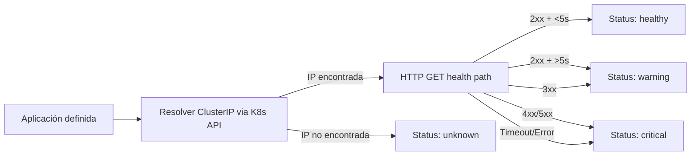

# Collector: Aplicaciones

**Archivo**: `src/backend/services/collectors/app.collector.ts`
**Categoría**: `app`
**Intervalo**: 120 segundos
**Dependencias**: Kubernetes API (resolución de IPs), HTTP fetch

## Método de recolección

Para cada aplicación:

1. **Resolver IP**: Se consulta la API de Kubernetes para obtener la ClusterIP del Service (`coreV1Api.readNamespacedService`)
2. **Health check HTTP**: Se hace un `GET` al path de salud de la aplicación
3. **Evaluar respuesta**: Se determina el estado según el código HTTP y el tiempo de respuesta



## Aplicaciones monitorizadas

| Aplicación | Namespace | Health Path | Puerto | Protocolo |
|-----------|-----------|-------------|--------|-----------|
| n8n | n8n | `/` | 5678 | HTTP |
| langflow | langflow | `/health` | 7860 | HTTP |
| gibbon | gibbon | `/` | 80 | HTTP |
| openclaw | openclaw | `/` | 3000 | HTTP |
| minecraft-stats | minecraft | `/` | 80 | HTTP |
| passbolt | passbolt | `/healthcheck/status.json` | 443 | HTTPS |
| wireguard | apptolast-wireguard | `/` | 51821 | HTTP |
| shlink | shlink | `/rest/health` | 8080 | HTTP |
| greenhouse-admin | apptolast-greenhouse-admin-prod | `/` | 80 | HTTP |
| invernaderos-api | apptolast-invernadero-api | `/` | 3000 | HTTP |
| menus-backend | apptolast-menus-dev | `/` | 3000 | HTTP |
| whoop-david-api | apptolast-whoop-david-api-prod | `/` | 3000 | HTTP |
| redisinsight | redisinsight | `/` | 5540 | HTTP |
| rancher | cattle-system | `/healthz` | 443 | HTTPS |
| traefik-dashboard | traefik | `/ping` | 9000 | HTTP |

!!! note "Detección de protocolo"
    El protocolo se determina automáticamente: si el puerto es 443, se usa HTTPS; en cualquier otro caso, HTTP.

## Lógica de estado

| Condición | Estado |
|-----------|--------|
| HTTP 2xx y tiempo de respuesta <5s | `healthy` |
| HTTP 2xx pero tiempo de respuesta >5s | `warning` |
| HTTP 3xx (redirect) | `warning` |
| HTTP 4xx o 5xx | `critical` |
| Timeout (>10 segundos) | `critical` |
| Error de conexión | `critical` |
| No se pudo resolver la IP del Service | `unknown` |

## Configuración

| Parámetro | Valor |
|-----------|-------|
| Timeout de HTTP | 10 segundos |
| Umbral de respuesta lenta | 5 segundos |
| Redirect handling | `manual` (no sigue redirects) |

## Datos almacenados

Cada snapshot incluye:

```json
{
  "url": "http://10.43.x.x:5678/",
  "statusCode": 200,
  "responseTimeMs": 45
}
```

O en caso de error:

```json
{
  "url": "http://10.43.x.x:5678/",
  "error": "Timeout",
  "responseTimeMs": 10000
}
```
