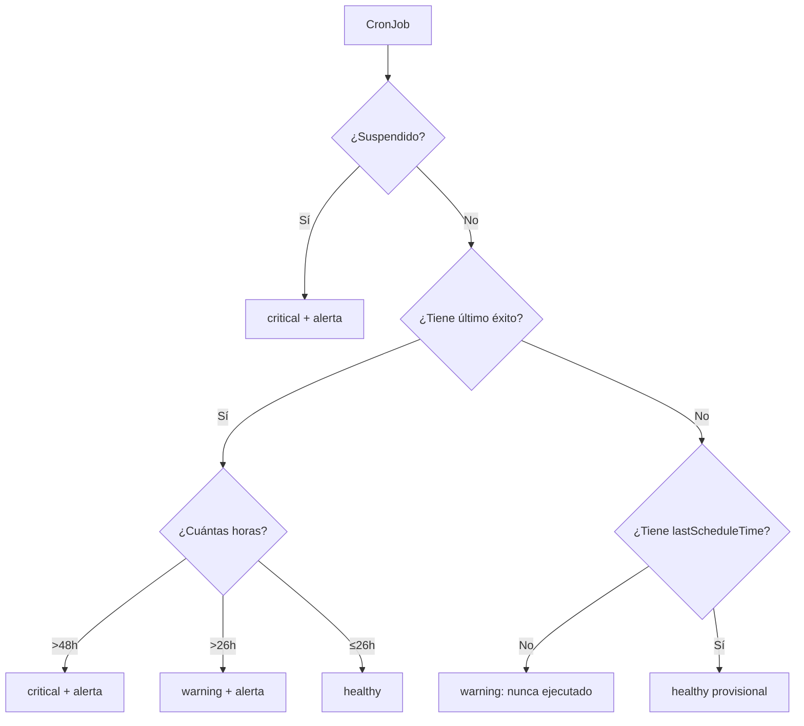

# Collector: Backups

**Archivo**: `src/backend/services/collectors/backup.collector.ts`
**Categoría**: `backup`
**Intervalo**: 3600 segundos (1 hora)
**Dependencias**: Kubernetes API (Batch v1)

## Método de recolección

El collector consulta todos los CronJobs del clúster Kubernetes.

**API**: `batchV1Api.listCronJobForAllNamespaces()`
**Tipo de recurso**: `cronjob`

## Datos recopilados

| Dato | Origen |
|------|--------|
| Nombre | `cronJob.metadata.name` |
| Namespace | `cronJob.metadata.namespace` |
| Schedule | `cronJob.spec.schedule` (expresión cron) |
| Suspend | `cronJob.spec.suspend` |
| Last schedule time | `cronJob.status.lastScheduleTime` |
| Last successful time | `cronJob.status.lastSuccessfulTime` |
| Active jobs | `cronJob.status.active.length` |

## Lógica de estado



**Umbrales:**

| Umbral | Valor | Estado |
|--------|-------|--------|
| `HEALTHY_THRESHOLD_HOURS` | 26 horas | `warning` si se supera |
| `CRITICAL_THRESHOLD_HOURS` | 48 horas | `critical` si se supera |

## Alertas generadas

| Condición | Severidad | Mensaje |
|-----------|-----------|---------|
| CronJob suspendido | `critical` | `CronJob {nombre} is suspended` |
| Último éxito hace >48h | `critical` | `CronJob {nombre} last succeeded Xh ago (>48h)` |
| Último éxito hace >26h | `warning` | `CronJob {nombre} last succeeded Xh ago (>26h)` |

## Marcador especial

El CronJob `postgres-backup` en el namespace `n8n` se marca internamente con `isPostgresBackup: true` para identificarlo como backup crítico de la base de datos de n8n.

## Datos almacenados

```json
{
  "schedule": "0 2 * * *",
  "suspend": false,
  "lastScheduleTime": "2026-04-08T02:00:00Z",
  "lastSuccessfulTime": "2026-04-08T02:05:30Z",
  "activeJobs": 0,
  "isPostgresBackup": false
}
```
