# Collector: Bases de Datos

**Archivo**: `src/backend/services/collectors/database.collector.ts`
**Categoría**: `database`
**Intervalo**: 120 segundos
**Dependencias**: Prometheus exporters (HTTP), TCP probes

## Estrategia de recolección en 2 fases

```mermaid
graph TD
    START[Inicio de recolección] --> PHASE1[Fase 1: Prometheus Exporters]
    PHASE1 --> PG[Postgres Exporter]
    PHASE1 --> RD[Redis Exporter]
    PG --> COVERED{¿DBs cubiertas?}
    RD --> COVERED
    COVERED --> PHASE2[Fase 2: TCP checks]
    PHASE2 --> TCP[TCP connect para DBs no cubiertas]
    TCP --> END[Fin]

    style PHASE1 fill:#1a3a1a
    style PHASE2 fill:#3a1a1a
```

### Fase 1: Prometheus Exporters

Se consultan exporters de Prometheus para obtener métricas detalladas:

**Postgres Exporter** (`POSTGRES_EXPORTER_URL`):
- URL por defecto: `http://postgres-exporter.monitoring.svc.cluster.local:9187/metrics`
- Métricas extraídas: `pg_up`, `pg_stat_activity_count`, `pg_database_size_bytes`, `pg_stat_replication_pg_wal_lsn_diff`

**Redis Exporter** (`REDIS_EXPORTER_URL`):
- URL por defecto: `http://redis-exporter.monitoring.svc.cluster.local:9121/metrics`
- Métricas extraídas: `redis_up`, `redis_connected_clients`, `redis_used_memory_bytes`, `redis_uptime_in_seconds`

### Fase 2: TCP Connectivity

Para las bases de datos **no cubiertas** por los exporters de Prometheus, se realiza una comprobación TCP simple:

- Se intenta conectar al host:puerto con un timeout de 5 segundos
- Si conecta → `healthy` + se resuelve cualquier alerta previa
- Si no conecta → `critical` + se genera alerta

## Targets monitorizados

| Nombre | Tipo | Host | Puerto | Namespace |
|--------|------|------|--------|-----------|
| postgres-n8n | postgresql | `postgres-n8n.n8n.svc.cluster.local` | 5432 | n8n |
| postgresql-langflow | postgresql | `postgresql-langflow.langflow.svc.cluster.local` | 5432 | langflow |
| postgres-metadata | postgresql | `postgres-metadata.apptolast-invernadero-api.svc.cluster.local` | 5432 | apptolast-invernadero-api |
| timescaledb | timescaledb | `timescaledb.apptolast-invernadero-api.svc.cluster.local` | 5432 | apptolast-invernadero-api |
| mysql-gibbon | mysql | `mysql-gibbon.gibbon.svc.cluster.local` | 3306 | gibbon |
| redis-db | redis | `redis-db.default.svc.cluster.local` | 6379 | default |
| redis-coordinator | redis | `redis-coordinator.n8n.svc.cluster.local` | 6379 | n8n |
| redis | redis | `redis.apptolast-invernadero-api.svc.cluster.local` | 6379 | apptolast-invernadero-api |
| emqx | mqtt | `emqx.apptolast-invernadero-api.svc.cluster.local` | 1883 | apptolast-invernadero-api |

## Lógica de estado

### PostgreSQL (via exporter)

| Condición | Estado |
|-----------|--------|
| `pg_up = 0` | `critical` |
| Conexiones > 100 | `warning` |
| Replication lag > 1MB | `warning` |
| Todo normal | `healthy` |

### Redis (via exporter)

| Condición | Estado |
|-----------|--------|
| `redis_up = 0` | `critical` |
| Clientes conectados > 500 | `warning` |
| Memoria usada > 2GB | `warning` |
| Todo normal | `healthy` |

### TCP check (fallback)

| Condición | Estado |
|-----------|--------|
| Conexión TCP exitosa | `healthy` |
| Conexión TCP fallida | `critical` |

## Alertas generadas

| Condición | Severidad | Mensaje |
|-----------|-----------|---------|
| TCP connect fallido | `critical` | `{tipo} {nombre} is unreachable (TCP connect failed)` |
| PostgreSQL pg_up=0 | `critical` | `PostgreSQL instance {nombre} is down (pg_up=0)` |

Las alertas se **auto-resuelven** cuando la base de datos vuelve a estar accesible.

## Variables de entorno

| Variable | Valor por defecto |
|----------|-------------------|
| `POSTGRES_EXPORTER_URL` | `http://postgres-exporter.monitoring.svc.cluster.local:9187/metrics` |
| `REDIS_EXPORTER_URL` | `http://redis-exporter.monitoring.svc.cluster.local:9121/metrics` |

## Parser de Prometheus

El collector utiliza un parser personalizado (`src/backend/lib/prometheus-parser.ts`) para interpretar el formato de texto de Prometheus y extraer métricas con sus etiquetas.
