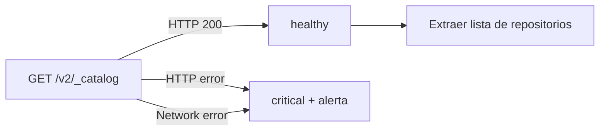

# Collector: Docker

**Archivo**: `src/backend/services/collectors/docker.collector.ts`
**Categoría**: `docker`
**Intervalo**: 300 segundos (5 minutos)
**Dependencias**: HTTP (Docker Registry API v2)

## Método de recolección

El collector consulta el endpoint de catálogo del Docker Registry local.

### Registry local

**URL**: `http://localhost:5000/v2/_catalog`
**Tipo de recurso**: `registry`
**Timeout**: 10 segundos



## Datos recopilados

### Respuesta exitosa
```json
{
  "statusCode": 200,
  "repositories": ["apptolast/matrix-cubepath", "apptolast/invernaderos-api", ...],
  "repositoryCount": 5
}
```

### Respuesta con error HTTP
```json
{
  "statusCode": 503,
  "statusText": "Service Unavailable"
}
```

### Error de conexión
```json
{
  "error": "fetch failed: ECONNREFUSED"
}
```

## Lógica de estado

| Condición | Estado |
|-----------|--------|
| HTTP 200 OK | `healthy` |
| HTTP error (4xx/5xx) | `critical` |
| Error de conexión/timeout | `critical` |

## Alertas generadas

| Condición | Severidad | Mensaje |
|-----------|-----------|---------|
| HTTP error | `critical` | `Docker registry returned HTTP {status}: {statusText}` |
| Error de red | `critical` | `Docker registry unreachable: {error}` |
