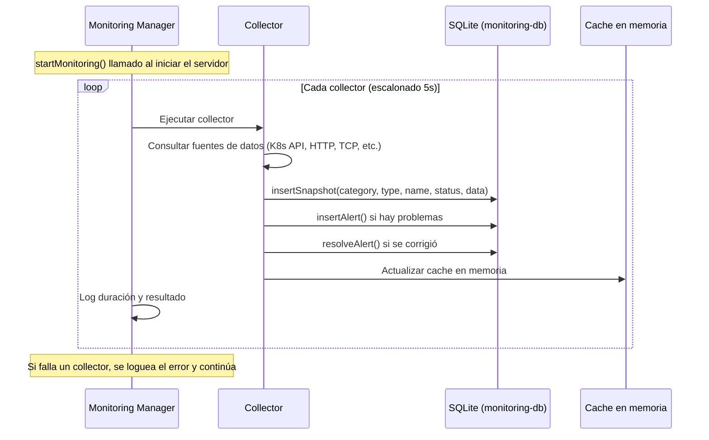

# Collectors

Los collectors son servicios backend que recopilan métricas de la infraestructura de forma periódica. Cada collector es independiente y se ejecuta en su propio intervalo.

## Resumen

| Collector | Archivo fuente | Categoría | Intervalo | Recursos monitorizados |
|-----------|---------------|-----------|-----------|----------------------|
| [Kubernetes](kubernetes.md) | `k8s.collector.ts` | `k8s` | 60s | Nodes, Pods, Deployments, Services, Events, Namespaces |
| [Bases de Datos](databases.md) | `database.collector.ts` | `database` | 120s | 9 DBs (PostgreSQL, TimescaleDB, MySQL, Redis, MQTT) |
| [Aplicaciones](applications.md) | `app.collector.ts` | `app` | 120s | 15 aplicaciones (HTTP health checks) |
| [IoT](iot.md) | `iot.collector.ts` | `iot` | 120s | EMQX MQTT broker |
| [Red](network.md) | `network.collector.ts` | `network` | 300s | Traefik routes, Certificates, MetalLB, DNS |
| [Almacenamiento](storage.md) | `storage.collector.ts` | `storage` | 300s | PVCs, Longhorn volumes |
| [Docker](docker.md) | `docker.collector.ts` | `docker` | 300s | Registry local |
| [Seguridad](security.md) | `security.collector.ts` | `security` | 600s | TLS certs, WireGuard VPN, Passbolt |
| [Backups](backups.md) | `backup.collector.ts` | `backup` | 3600s | CronJobs de Kubernetes |

## Flujo de ejecución



## Inicio escalonado

Para evitar picos de carga, los collectors se inician con un retraso de 5 segundos entre cada uno:

```mermaid
gantt
    title Inicio de collectors (primeros 50 segundos)
    dateFormat ss
    axisFormat %S s

    section Collectors
    k8s           :k8s, 05, 1s
    database      :db, 10, 1s
    app           :app, 15, 1s
    iot           :iot, 20, 1s
    network       :net, 25, 1s
    storage       :stor, 30, 1s
    docker        :dock, 35, 1s
    security      :sec, 40, 1s
    backup        :bak, 45, 1s
```



Después del inicio inicial, cada collector se ejecuta en su propio intervalo independiente.

## Ejecución manual

Todos los collectors pueden ejecutarse manualmente desde la UI con el botón **"Refresh"**, que llama a `POST /monitoring/refresh`. Esto ejecuta todos los collectors secuencialmente.

## Manejo de errores

- Si un collector falla, el error se loguea pero **no afecta a otros collectors**
- Cada sub-collector dentro de un collector principal también se ejecuta independientemente
- Si la API de Kubernetes no está disponible, los collectors que la necesitan se saltan con un warning

## Ubicación del código

Todos los collectors se encuentran en:
```
src/backend/services/collectors/
├── k8s.collector.ts
├── database.collector.ts
├── app.collector.ts
├── iot.collector.ts
├── network.collector.ts
├── storage.collector.ts
├── docker.collector.ts
├── security.collector.ts
└── backup.collector.ts
```

El orquestador está en:
```
src/backend/services/monitoring-manager.ts
```
