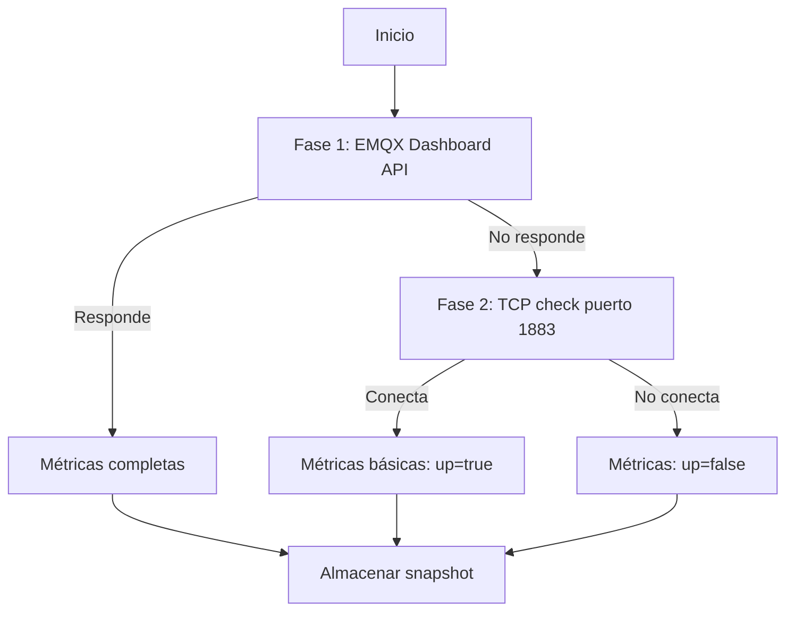

# Collector: IoT

**Archivo**: `src/backend/services/collectors/iot.collector.ts`
**Categoría**: `iot`
**Intervalo**: 120 segundos
**Dependencias**: EMQX Dashboard API (HTTP), TCP probe (fallback)

## Estrategia de recolección en 2 fases



### Fase 1: EMQX Dashboard API

Se consultan 2 endpoints de la API REST de EMQX:

1. **`GET /api/v5/stats`** — Estadísticas generales del broker
2. **`GET /api/v5/clients?limit=1`** — Conteo preciso de clientes (solo se usa `meta.count`)

**Métricas extraídas de `/api/v5/stats`:**

| Campo de la API | Métrica |
|-----------------|---------|
| `live_connections.count` o `connections.count` | Clientes conectados |
| `connections.max` | Máximo de conexiones |
| `subscriptions.count` | Suscripciones activas |
| `topics.count` | Topics activos |
| `messages.received` | Mensajes recibidos (total) |
| `messages.sent` | Mensajes enviados (total) |
| `retained.count` | Mensajes retenidos |

### Fase 2: TCP fallback

Si la API no responde, se hace una comprobación TCP al puerto MQTT (1883):

- Solo determina si el broker está arriba o no
- Todas las métricas numéricas se establecen en 0

## Configuración

| Parámetro | Variable de entorno | Valor por defecto |
|-----------|-------------------|-------------------|
| URL de la API | `EMQX_API_URL` | `http://emqx.apptolast-invernadero-api.svc.cluster.local:18083` |
| API Key | `EMQX_API_KEY` | (vacío) |
| Puerto MQTT | - | 1883 |
| Puerto Dashboard | - | 18083 |
| Timeout HTTP | - | 10.000 ms |
| Timeout TCP | - | 5.000 ms |
| Namespace | - | `apptolast-invernadero-api` |

!!! note "Autenticación"
    Si `EMQX_API_KEY` está configurada, se envía como cabecera `Authorization: Basic {base64(key)}`.

## Lógica de estado

| Condición | Estado |
|-----------|--------|
| Broker accesible y clientes >0 | `healthy` |
| Broker accesible pero 0 clientes | `warning` |
| Broker no accesible | `critical` |

## Alertas generadas

| Condición | Severidad | Mensaje | Auto-resolución |
|-----------|-----------|---------|-----------------|
| Broker no accesible | `critical` | `EMQX MQTT broker is unreachable` | Sí |
| 0 clientes conectados | `warning` | `EMQX MQTT broker has no connected clients` | Sí |

## Datos almacenados

```json
{
  "up": true,
  "connections": 5,
  "maxConnections": 10,
  "subscriptionCount": 12,
  "topicCount": 8,
  "messagesReceived": 150432,
  "messagesSent": 150430,
  "retainedMessages": 3,
  "responseTimeMs": 45,
  "source": "api"
}
```
