# Monitorización de Infraestructura

Documentación completa del módulo de monitorización de infraestructura de **matrix-cubepath**. Este módulo proporciona visibilidad en tiempo real sobre el 100% de la infraestructura del servidor Apptolast.

## Resumen de la infraestructura

| Recurso | Cantidad aproximada |
|---------|-------------------|
| Pods Kubernetes | ~113 |
| Namespaces | ~56 |
| Bases de datos | 9 (PostgreSQL, TimescaleDB, MySQL, Redis, MQTT) |
| Aplicaciones monitorizadas | 15 |
| Broker MQTT (EMQX) | 1 |
| Dominios DNS críticos | 4 |

## Las 9 categorías de monitorización

```mermaid
graph TD
    INFRA[Monitorización de Infraestructura] --> K8S[Kubernetes]
    INFRA --> DB[Bases de Datos]
    INFRA --> APP[Aplicaciones]
    INFRA --> NET[Red]
    INFRA --> STOR[Almacenamiento]
    INFRA --> DOCK[Docker]
    INFRA --> SEC[Seguridad]
    INFRA --> BAK[Backups]
    INFRA --> IOT[IoT]

    K8S --> K8S1[Nodes]
    K8S --> K8S2[Pods]
    K8S --> K8S3[Deployments]
    K8S --> K8S4[Services]
    K8S --> K8S5[Namespaces]
    K8S --> K8S6[Events]

    DB --> DB1[PostgreSQL x3]
    DB --> DB2[TimescaleDB x1]
    DB --> DB3[MySQL x1]
    DB --> DB4[Redis x3]
    DB --> DB5[EMQX MQTT x1]

    APP --> APP1[15 aplicaciones]

    NET --> NET1[Traefik IngressRoutes]
    NET --> NET2[Certificados TLS]
    NET --> NET3[MetalLB]
    NET --> NET4[DNS]

    STOR --> STOR1[PVCs]
    STOR --> STOR2[Longhorn Volumes]

    DOCK --> DOCK1[Registry local]

    SEC --> SEC1[Certificados TLS]
    SEC --> SEC2[WireGuard VPN]
    SEC --> SEC3[Passbolt]

    BAK --> BAK1[CronJobs K8s]

    IOT --> IOT1[EMQX Broker]
```

## Cómo acceder

La monitorización de infraestructura se accede desde la pestaña **"Infrastructure"** en la barra lateral de la aplicación. Dentro de esta vista, hay **11 sub-pestañas** navegables:

1. **Dashboard** — Vista general con resumen de salud y alertas activas
2. **Kubernetes** — Nodos, pods, deployments, services, namespaces, events
3. **Bases de Datos** — Estado de las 9 bases de datos
4. **Aplicaciones** — Health checks de las 15 aplicaciones
5. **Red** — Ingress routes, certificados, DNS
6. **Almacenamiento** — PVCs y volúmenes Longhorn
7. **Docker** — Registry local
8. **Seguridad** — Certificados TLS, VPN, gestor de contraseñas
9. **Backups** — CronJobs de backup
10. **IoT** — Broker MQTT EMQX
11. **Alertas** — Todas las alertas con filtros y acknowledge

## Sistema de estados

Todos los recursos monitorizados tienen uno de estos 4 estados:

| Estado | Color | Significado |
|--------|-------|-------------|
| `healthy` | Verde | Funcionando correctamente |
| `warning` | Amarillo | Requiere atención, posible degradación |
| `critical` | Rojo (pulsante) | Fallo crítico, requiere acción inmediata |
| `unknown` | Gris | No se pudo determinar el estado |

## Stack técnico

- **Backend**: Express.js + TypeScript con 9 collectors independientes
- **Base de datos de monitorización**: SQLite separada (monitoring-db)
- **Frontend**: React + TypeScript + TanStack Query
- **Estilos**: Tailwind CSS con tema "matrix" oscuro
- **Despliegue**: Kubernetes con ServiceAccount read-only
