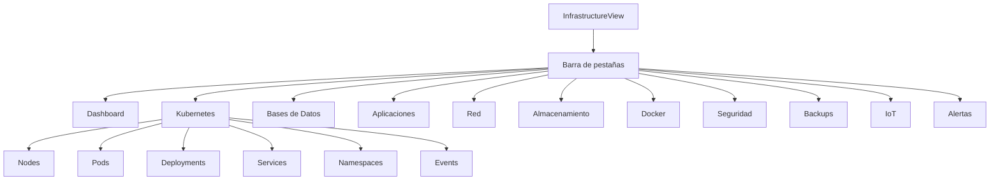

# Vistas de la UI

El módulo de monitorización de infraestructura está organizado en **11 sub-vistas** accesibles mediante pestañas horizontales en la parte superior de la vista "Infrastructure".

## Navegación

La vista principal (`InfrastructureView`) muestra una barra de pestañas con scroll horizontal para pantallas pequeñas. Cada pestaña carga una sub-vista independiente. Un botón **"Refresh"** a la derecha permite forzar una recolección manual de todos los collectors.

## Mapa de vistas

## Lista de vistas

| Vista | Componente | Hook | Endpoint API | Auto-refresh |
|-------|-----------|------|-------------|--------------|
| [Dashboard](dashboard.md) | `InfraDashboard` | `useMonitoringDashboard` | `GET /monitoring/dashboard` | 60s |
| [Kubernetes](kubernetes.md) | `KubernetesView` | `useKubernetes` | `GET /monitoring/kubernetes` | 60s |
| [Bases de Datos](databases.md) | `DatabasesView` | `useDatabases` | `GET /monitoring/databases` | 120s |
| [Aplicaciones](applications.md) | `ApplicationsView` | `useApplications` | `GET /monitoring/applications` | 120s |
| [Red](network.md) | `NetworkView` | `useNetwork` | `GET /monitoring/network` | 300s |
| [Almacenamiento](storage.md) | `StorageView` | `useStorage` | `GET /monitoring/storage` | 300s |
| [Docker](docker.md) | `DockerView` | `useDocker` | `GET /monitoring/docker` | - |
| [Seguridad](security.md) | `SecurityView` | `useSecurity` | `GET /monitoring/security` | - |
| [Backups](backups.md) | `BackupsView` | `useBackups` | `GET /monitoring/backups` | - |
| [IoT](iot.md) | `IoTView` | `useIoT` | `GET /monitoring/iot` | 120s |
| [Alertas](alerts.md) | `AlertsView` | `useMonitoringAlerts` | `GET /monitoring/alerts` | 60s |

## Componentes compartidos

Todas las vistas utilizan componentes reutilizables de `infrastructure/shared/`:

- **StatusBadge** — Indicador visual del estado (healthy/warning/critical/unknown)
- **MetricCard** — Tarjeta con icono, valor, subtítulo y estado
- **ResourceTable** — Tabla genérica con ordenamiento y búsqueda

Consulta la sección de [Arquitectura](../architecture.md#componentes-ui-compartidos) para más detalles.
